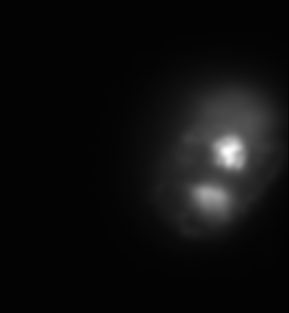

### PickShot - model

#### Models:
1. [Draq5 - nuclei](#dq) 

 

##### 1. Draq5 - nuclei 

The model identifies good and poor-quality images in flow cytometry of nuclear staining using DRAQ5, utilizing the ImageStream Amnis cytometer. DRAQ5 is a far-red fluorescent dye that selectively binds to DNA, allowing nuclear visualization without interfering with other fluorescence channels (emission: 665–780 nm). ImageStream Amnis combines high-resolution imaging with quantitative analysis, enabling precise assessment of cell morphology, size, and fluorescence intensity. The model automatically discards low-quality images, significantly enhancing analysis speed and accuracy.

 

###### Images to drop:

    
    
    

###### Images to save:

    
    
    

 

#### Have fun JBS©